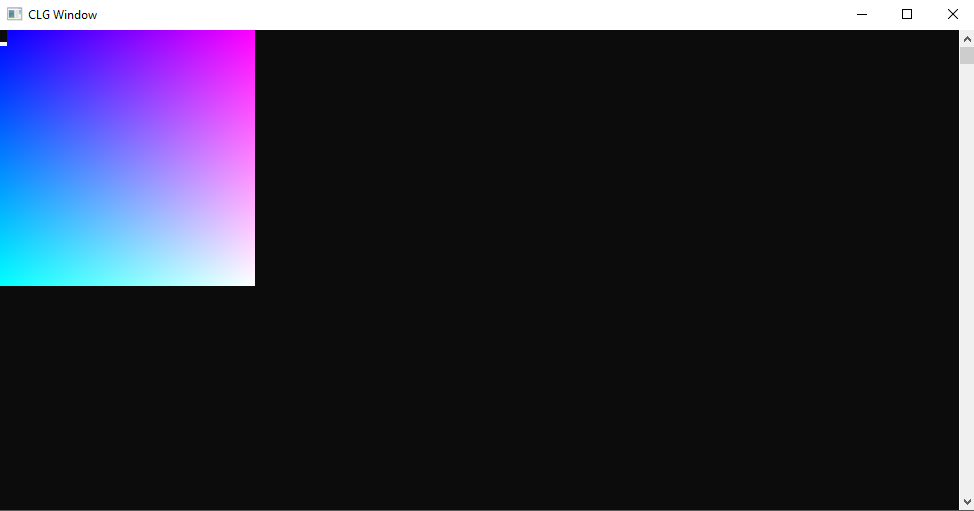

#Command-line graphics
**Command-line graphics** is a header file which simplifies and gives you access to some Windows console functions.

It can be used to colorize Windows console and text, to draw simple rectangles etc.
It's my old project, so it's a complete mess and spaghetti code, but I think it's usefull.

##How to use?
Extract those three files, then include "CLG_library.h" in your project and you are ready to go!
For documentation see DOCUMENTATION.md

##How to contribute?
Anybody can contribute this repository and make changes to it.

##Example outputs:

